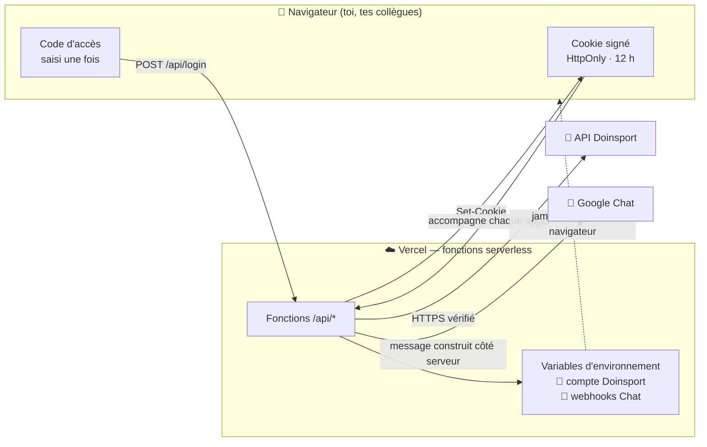
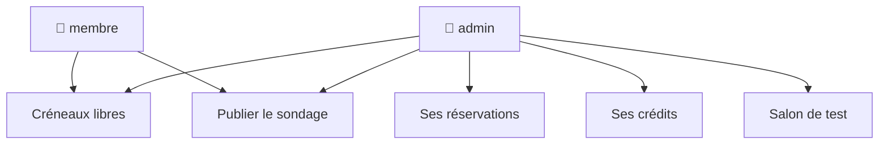

# 🏸 HomeSmash

Les créneaux de badminton du Bad's Club, sur le téléphone : voir les terrains
libres du midi, consulter ses réservations, et proposer un sondage au groupe
sur Google Chat.

Application web installable (PWA), déployée sur Vercel. Un CLI Python
accompagne le tout pour les mêmes opérations en ligne de commande.

---

## Le principe de sécurité en une image

Le compte Doinsport qui sert à réserver ne quitte jamais le serveur. Le
navigateur ne connaît que son propre code d'accès, et encore : il ne le garde
même pas.



La métaphore : le serveur est un **vestiaire avec gardien**. Chacun présente son
badge à l'entrée (le code d'accès) et reçoit un bracelet daté (le cookie). Le
trousseau de clés du club — le compte qui peut réserver — reste dans la loge du
gardien. Personne ne le voit, personne ne repart avec.

### Ce que protège chaque pièce

| Mécanisme | Ce qu'il empêche |
|---|---|
| Identifiants Doinsport en variables d'environnement | Qu'un collègue, ou n'importe qui, lise le mot de passe du compte dans le code de la page |
| Un code d'accès **par personne** (`prénom:code:rôle`) | De devoir changer le mot de passe de tout le monde pour en retirer un seul |
| Cookie signé HMAC-SHA256, `HttpOnly` `Secure` `SameSite=Strict` | Qu'un script de page lise la session, qu'un autre site la rejoue |
| Expiration à 12 h, sans renouvellement silencieux | Qu'un téléphone perdu reste connecté indéfiniment |
| Limitation de débit sur `/api/login` (8 essais / 15 min) + réponse ralentie | Qu'on devine un code en le testant en boucle |
| Rôles `admin` / `membre` | Que les collègues voient les réservations et les crédits personnels |
| Contenu Google Chat **reconstruit côté serveur** | Qu'un code d'accès permette d'écrire n'importe quoi dans le salon de l'équipe |
| Quota de publication (6 messages / h / personne) | Qu'on inonde le salon de l'équipe |
| CSP stricte, `noindex`, `frame-ancestors 'none'`, HSTS | Que l'app charge un script tiers, soit indexée, ou soit encadrée par un site pirate |
| Vérification TLS rétablie (voir plus bas) | Qu'un réseau hostile intercepte le mot de passe du compte |

---

## Mettre en ligne sur Vercel

1. **Importer le dépôt.** [vercel.com/new](https://vercel.com/new) → `benjaminschaal/homesmash`.
   Ne rien changer aux réglages de construction : `vercel.json` les fixe déjà.

2. **Générer la clé de session.**

   ```bash
   openssl rand -base64 48
   ```

3. **Renseigner les variables** dans *Settings › Environment Variables*
   (Production, Preview et Development) :

   | Variable | Contenu |
   |---|---|
   | `SESSION_SECRET` | la sortie de la commande ci-dessus |
   | `HOMESMASH_ACCESS_CODES` | `benjamin:UN-CODE-LONG:admin,marc:UN-AUTRE-CODE,julie:ENCORE-UN-AUTRE` |
   | `DOINSPORT_LOGIN` | ton numéro (`0612345678`) ou ton email |
   | `DOINSPORT_PASSWORD` | le mot de passe du compte Doinsport |
   | `DOINSPORT_CLUB_ID` | `f520b68c-d5dd-4fd2-84b0-3e0742a771a2` |
   | `DOINSPORT_ACTIVITY_ID` | `541b8d8a-3ce2-4f46-913c-5e6e4d9b5dea` |
   | `DOINSPORT_CATEGORY_ID` | `190e89c2-98a1-4f3b-a23d-df5c921e9324` |
   | `GOOGLE_CHAT_WEBHOOK_PROD` | l'URL du salon de l'équipe |
   | `GOOGLE_CHAT_WEBHOOK_TEST` | l'URL de ton salon de test |

   > Les codes font **12 caractères minimum** et il en faut au moins un marqué
   > `:admin` — sinon l'application refuse de démarrer et le dit à l'écran.
   > Une phrase courte (`raquette-volant-midi-42`) vaut mieux qu'un code court
   > et compliqué : plus longue à deviner, plus facile à dicter à un collègue.

4. **Déployer**, puis vérifier :

   ```bash
   curl -s -o /dev/null -w "%{http_code}\n" https://<ton-app>.vercel.app/api/session   # 401 attendu
   curl -sI https://<ton-app>.vercel.app/ | grep -i strict-transport                    # HSTS présent
   ```

   `401` sans cookie signifie que la porte est bien fermée. `503` veut dire
   qu'une variable manque : l'écran d'accueil précise laquelle.

5. *(facultatif)* **Ajouter Upstash Redis** — *Storage › Upstash for Redis*.
   La limitation de débit devient alors commune à toutes les instances au lieu
   d'être locale à chacune. Rien à configurer, les variables sont posées toutes
   seules ; il faut simplement **redéployer** après.

### Partager avec les collègues

Envoie-leur l'adresse **et leur code**, séparément si possible (le lien dans
Chat, le code de vive voix). Sur iPhone : ouvrir dans **Safari** → Partager →
*Sur l'écran d'accueil*, puis lancer depuis l'icône. Hors mode installé, Safari
efface les données du site après 7 jours d'inactivité.

**Retirer quelqu'un** : supprimer sa ligne de `HOMESMASH_ACCESS_CODES` et
redéployer. **Déconnecter tout le monde d'un coup** : changer `SESSION_SECRET`.

---

## Ce que voit chaque rôle



Un collègue voit les terrains libres et peut lancer un sondage : c'est tout
l'intérêt de l'app. Il ne voit ni tes réservations, ni le solde de tes packs —
côté serveur, `/api/bookings` et `/api/credits` lui répondent `403`.

---

## Développer en local

```bash
npm install
cp .env.example .env      # puis remplir
npx vercel dev            # sert le front ET les fonctions /api sur :3000
```

`npm run dev` seul lance le front sans les fonctions : les appels `/api/*`
échouent alors, c'est normal.

---

## CLI Python

Le CLI ne dépend plus de Streamlit : il lit `.env` ou les variables
d'environnement (les mêmes noms que sur Vercel).

```bash
python3 -m venv .venv && source .venv/bin/activate
pip install requests

python -m homesmash affiche_dispo                       # 2 semaines par défaut
python -m homesmash affiche_dispo --semaine 20 --nb-semaines 4
python -m homesmash publie_dispo                        # sondage sur Chat
python -m homesmash affiche_resa --historique 4
python -m homesmash publie_resa
```

---

## Deux points de sécurité corrigés au passage

**La vérification TLS était désactivée.** Chaque appel Python portait
`verify=False`, et les avertissements correspondants étaient masqués. C'est la
seule vérification qui distingue le vrai `api-v3.doinsport.club` d'un
intermédiaire qui s'en réclame : sur un Wi-Fi public ou un réseau d'entreprise
qui inspecte le trafic, le mot de passe du compte partait dans un tunnel
ouvrable, sans le moindre signe. Rétabli partout, côté Python comme côté Node.

**Un mot de passe unique, partagé, sans limitation d'essais.** L'ancienne
interface Streamlit comparait la saisie à un `APP_PASSWORD` commun, sans plafond
de tentatives. Remplacé par un code par personne, comparé en temps constant,
avec plafond et réponse ralentie.

### Une seule porte à la fois

`homesmash/app.py` (Streamlit) est conservé et fonctionne toujours, mais il
affiche désormais un bandeau : tant qu'il reste déployé sur Streamlit Cloud, le
même compte Doinsport a **deux portes d'entrée**, et c'est la plus faible qui
fixe le niveau de sécurité réel. Une fois la version Vercel en service, supprime
l'application sur [share.streamlit.io](https://share.streamlit.io/) et change le
mot de passe Doinsport (il a séjourné dans les secrets de deux hébergeurs).

---

## Structure

```
homesmash/
├── api/                    Fonctions serverless Vercel (Node 22)
│   ├── _lib/
│   │   ├── accessCodes.js  Codes par personne, comparaison en temps constant
│   │   ├── chat.js         Construction des cartes Google Chat
│   │   ├── doinsport.js    Client de l'API Doinsport (TLS vérifié)
│   │   ├── guard.js        withAuth() : la garde commune aux routes
│   │   ├── http.js         Réponses no-store, lecture de corps, bornes
│   │   ├── rateLimit.js    Limitation de débit (Redis, sinon mémoire)
│   │   └── session.js      Cookie signé HMAC
│   ├── announce.js         POST  publier sur Google Chat
│   ├── availability.js     GET   créneaux libres
│   ├── bookings.js         GET   réservations          (admin)
│   ├── credits.js          GET   crédits               (admin)
│   ├── login.js            POST  ouvrir une session
│   ├── logout.js           POST  fermer la session
│   └── session.js          GET   qui suis-je
├── src/                    Interface React (Vite)
├── public/                 Icônes PWA (volant)
├── homesmash/              CLI Python
├── docs/exploitation.md    Exploitation au quotidien
└── vercel.json             Construction + en-têtes de sécurité
```
