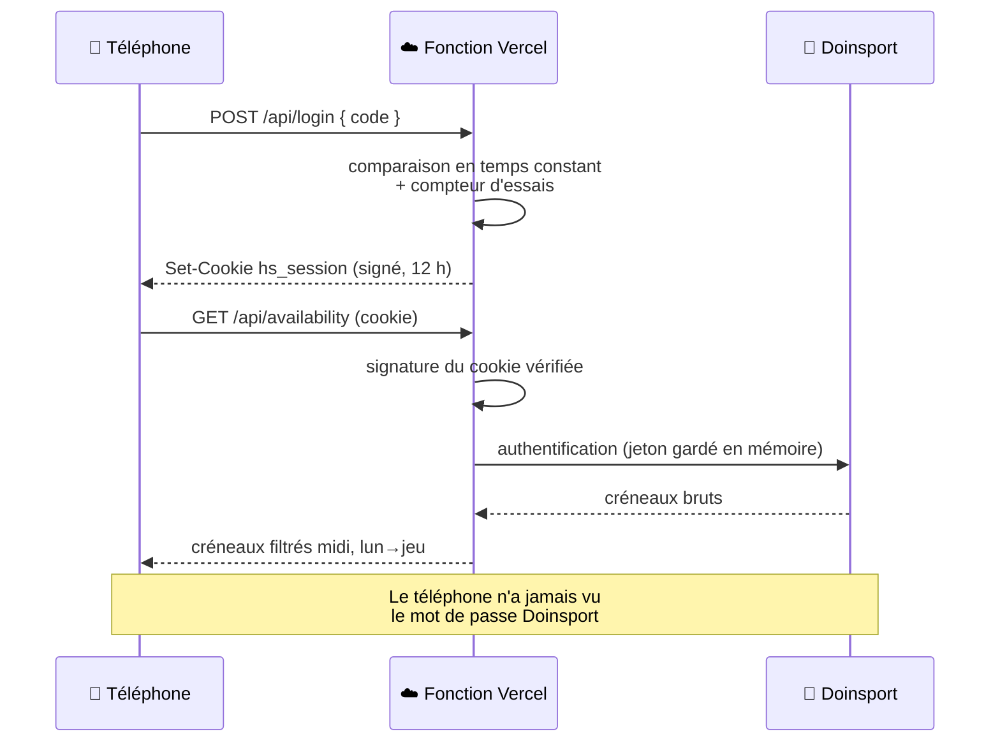

# HomeSmash — exploitation au quotidien

Ce document répond aux questions qu'on se pose *après* la mise en ligne :
qui a accès, comment on retire quelqu'un, quoi vérifier quand ça ne répond plus.

## Adresses

| Quoi | Où |
|---|---|
| Application | `https://<à compléter>.vercel.app` |
| Projet Vercel | `benjaminschaal/homesmash` |
| Code source | `github.com/benjaminschaal/homesmash` — **dépôt public** |
| API amont | `api-v3.doinsport.club` (compte Bad's Club) |

> Le dépôt étant public, **aucun secret n'y figure** : tout vit dans les
> variables d'environnement Vercel. C'est aussi pour cela que `.env` est ignoré
> par Git et que `.env.example` ne contient que des valeurs factices.

## Le chemin d'une requête



## Gérer les accès

Tout se joue dans une seule variable, `HOMESMASH_ACCESS_CODES` :

```
benjamin:phrase-longue-a-moi:admin,marc:phrase-longue-de-marc,julie:phrase-longue-de-julie
```

| Geste | Comment |
|---|---|
| Ajouter un collègue | Ajouter `prénom:code` à la liste, redéployer |
| Retirer un collègue | Supprimer sa portion, redéployer |
| Le passer admin | Ajouter `:admin` en fin de sa portion |
| Déconnecter tout le monde | Changer `SESSION_SECRET` (toutes les signatures deviennent invalides) |

Une modification de variable ne s'applique **qu'au déploiement suivant** :
Vercel les lit au démarrage de la fonction, pas à chaque appel. *Deployments ›
⋯ › Redeploy* suffit.

## Vérifier que tout va bien

```bash
APP=https://<ton-app>.vercel.app

curl -s -o /dev/null -w "%{http_code}\n" $APP/api/session          # 401 : porte fermée, tout va bien
curl -sI $APP/ | grep -iE 'strict-transport|x-frame|x-robots'      # en-têtes de sécurité présents
curl -s $APP/ | grep -o "connect-src[^;]*;"                        # doit afficher connect-src 'self';
```

| Réponse | Ce que ça dit |
|---|---|
| `401` | Normal sans cookie : l'application refuse bien les inconnus |
| `503` | Une variable manque. Le corps de la réponse nomme laquelle |
| `429` | Limitation de débit atteinte. Attendre le délai indiqué par `Retry-After` |
| `502` | Doinsport ne répond pas comme prévu. Le détail est dans les traces Vercel |

Les traces (*Vercel › Logs*) enregistrent les connexions et les publications
sous la forme `connexion : marc (membre)`. **Aucun code, aucun jeton, aucune URL
de webhook n'y figure** — c'est délibéré : des traces sont recopiées, exportées,
partagées.

## Que faire si un code fuite

1. Retirer la portion correspondante de `HOMESMASH_ACCESS_CODES`, redéployer.
2. Si le doute porte sur plusieurs personnes : changer aussi `SESSION_SECRET`,
   ce qui invalide immédiatement toutes les sessions en cours.
3. Le compte Doinsport lui-même n'est **pas** compromis pour autant : un code
   d'accès ne le révèle pas. Il ne donne que ce que l'application expose.

En revanche, si le doute porte sur les **variables Vercel** (accès au compte
Vercel, capture d'écran malencontreuse), il faut changer le mot de passe
Doinsport et régénérer les webhooks Google Chat.

## Mettre à jour

```bash
npm run build            # vérifier que ça compile
git add -A && git commit -m "…"
git push                 # Vercel déploie tout seul
```

Côté téléphones, rien à faire : le service worker télécharge la nouvelle version
en arrière-plan et l'applique à la réouverture. Sur iPhone, fermer la carte
depuis le sélecteur d'applications puis relancer depuis l'icône.

## Limites connues, assumées

- **La limitation de débit sans Redis est locale à chaque instance.** Vercel peut
  répondre depuis plusieurs instances : quelqu'un d'acharné obtient donc plus
  que 8 essais par quart d'heure. Le ralentissement de 400 ms sur chaque échec
  rend l'exercice pénible malgré tout. Brancher Upstash pour un compteur
  réellement global.
- **Les préversions Vercel** (`homesmash-<hash>.vercel.app`) partagent les mêmes
  variables si elles sont déclarées pour l'environnement *Preview*. Réserve-les
  à *Production* si tu veux que les préversions restent muettes.
- **L'application ne réserve pas.** Elle affiche et propose ; le bouton
  « Réserver » ouvre Doinsport. C'est volontaire : une réservation engage un
  crédit, ce geste reste manuel.
- **Les créneaux visés sont figés** : lundi à jeudi, 12h00 à 13h15. Ils vivent
  dans `api/_lib/doinsport.js` (`HEURES_CIBLES`, `JOURS`).
